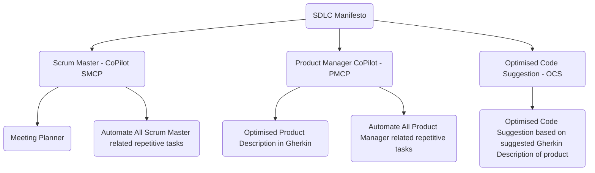

# PMaS
Product/Project/Program Manager as Service

**SDLC Manifesto - Overal Objectives**

<!--  -->

**SDLC Manifesto LEVEL 0**

**SDLC Manifesto LEVEL 1**

***please see [v1.feature](https://raw.githubusercontent.com/sdlcmanfiesto/PMaS/main/v1.feature) for desired level 1 gherkin format.***

***to try parsing v1.feature feel free to use [sdlc gherkin cli parser](https://github.com/rouzikrm/gherkin-python)***

**PMaS PURPOSE**

1- generate documents from given/when/then **(mvp1)**

2- help to create a disovery journey for product / tech by having a template for journey with multuple defenitions/keywords.

**PMaS QUESTIONS/RULES**

TBA

**PMaS TRIGGERS**

TBA

**LINK**

https://docs.google.com/presentation/d/1tLY5R2mtqFUT7JD0w9coZruG8QSmZgK0devKWxth21s/edit#slide=id.p
